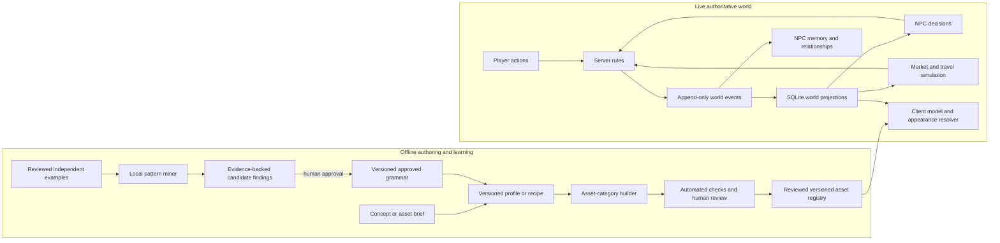

# Project Atlas Master File

This is the current source of truth for Project Atlas's vision, architecture,
decisions, and implementation status. It covers the playable world, character
pipeline, recipe learning, NPC behavior, and economy. Update it whenever a
feature, contract, or important design decision changes.

## Vision

Project Atlas should grow into a persistent, believable game world with a
traceable model pipeline for all game assets: people, creatures, clothing,
equipment, props, buildings, environments, resources, and other authored
content. It should learn reusable design knowledge from reviewed examples and
trial outcomes, and support NPCs with persistent identities, personalities,
emotional state, memories, goals, and relationships. Towns and cities should
have connected local economies that respond to production, demand, trade, and
events. Players and NPCs should affect the same auditable world state.

Use local deterministic tools for geometry, recipe analysis, and simulation
where practical; keep human review at quality-sensitive stages; and avoid
spending AI tokens on work ordinary code can do. A single image can guide
visible silhouette and appearance, but it does not contain all the depth,
topology, back-side anatomy, or rigging needed for a production model.

The system should also learn reusable design knowledge from collections of
reviewed character recipes. For example, after reviewing many independent troll
examples, it should be able to propose that certain traits or structural
relationships commonly occur together, show the evidence and uncertainty, and
offer those patterns when composing a new troll recipe. Learned patterns are
recommendations until reviewed; they must not silently become universal anatomy
rules.

## Principles

- Keep concept profiles, observed examples, learned findings, approved grammar
  rules, generated meshes, and runtime assets as separate versioned artifacts.
- Preserve source provenance, licenses, checksums, review state, and rule
  evidence at every stage.
- Separate an observed fact from an inference and an approved rule.
- Count independent examples, not repeated edits or renders of the same source.
- Keep generation and recipe analysis deterministic and local by default. No
  remote model call is required for the planned rule miner.
- Treat a low-detail parametric mesh as a blockout. Do not present it as a
  high-quality model or advance it to rigging without a reviewed sculpt or
  suitable high-detail source.
- Let evidence guide new recipes without forcing every member of an archetype
  into the same design. Preserve exceptions, intentional variation, and
  negative evidence.
- A topology pass is structural evidence, not a visual-quality approval.
- Keep simulation state, observations, beliefs, inferences, and decisions
  distinct. NPCs should not know facts they did not observe, learn, or receive.
- Make world changes replayable and explainable. A simulation result or NPC
  proposal is not a deployed world change until its rules permit it.
- Give each subsystem explicit data contracts, time scales, resource budgets,
  and evaluation gates so large populations can run predictably.

## System map

Offline recipe learning changes future authored candidates. Live NPC memory
changes individual behavior. The world event stream connects observable actions
and simulation outcomes to both, while review and policy gates control changes
to shared content or live rules.

## Architecture

### 1. Concept profile

`art/characters/profiles/*.json` stores an individual design brief, supported
proportion controls, palette, traits, and intended actions. The profile schema
validates shape and values; it does not understand arbitrary prose or sculpt a
mesh from it.

### 2. Example observations and recipe knowledge

`art/characters/recipe_observations/` is the planned dataset of independently
sourced, reviewed examples. Each observation uses
[`atlas-character-observation-v1.schema.json`](specs/atlas-character-observation-v1.schema.json)
and records canonical traits, measurements, explicit structural relationships,
source lineage, rights, and review status. A collection of 100 recipes should
be 100 traceable observations, not 100 derivatives counted as independent
evidence from one source.

The planned local analysis flow is:

1. Normalize names and aliases to versioned concept IDs.
2. Build a graph of observed regions, traits, and typed relationships.
3. Count co-occurrence and relationship patterns by archetype and context.
4. Emit a versioned *candidate findings* artifact with support, denominator,
   confidence, lift, uncertainty, exclusions, source IDs, and data hashes.
5. Review candidate findings. Only approved findings may be copied into the
   authored character grammar.
6. Compile a new character recipe from the requested concept plus applicable
   approved findings, while preserving optional traits and exceptions.

The planned miner must distinguish statements such as “these appeared together
in 78 of 100 reviewed troll examples” from rules such as “every troll must have
both.” It should not infer a relationship from text similarity alone. An
observation needs normalized fields or a human-reviewed extraction before it
can contribute evidence.

Atlas has three different learning/improvement loops, and they must not be
collapsed into one:

1. **Content learning:** offline patterns from independent, reviewed asset and
   recipe observations. This improves future recipes and asset authoring.
2. **Individual NPC learning:** an NPC updates its memories, beliefs, skills,
   preferences, and relationships from events that NPC experienced or learned
   about. This changes that individual, not the species grammar.
3. **World/system improvement:** creators compare simulation outcomes and
   reviewed play/production results, then propose versioned changes to rules,
   models, or tools. This does not automatically rewrite the live world.

Generated variations, copies, and NPC memories are not independent training
examples for content learning. System-wide rule updates need a separate
evaluation and approval path.

### 3. Authored grammar and recipe compiler

`art/characters/grammars/atlas_character_grammar_v1.json` contains shared
defaults, archetype guidance, and anatomy relationships with review status.
`tools/characters/compile_character_recipe.py` combines an individual profile
with the authored grammar and records input hashes. The compiler currently
does not mine cross-example patterns, and the grammar's prose relations are not
a statistical recipe dataset. Future relation-mining work should add a new
versioned contract rather than silently changing old recipe behavior.

### 3a. Evidence records versus executable model recipes

Recipe knowledge has two related but different data products:

- **Observation records** describe what a particular source actually shows:
  normalized features, measurements, relationships, source rights, lineage,
  review state, and uncertainty. They are evidence inputs; they do not tell a
  builder how to make an asset.
- **Model recipes** describe a reproducible candidate build: requested traits,
  parameter values and their provenance, dimensions and coordinate frame,
  geometry method and topology constraints, component links and transforms,
  material and texture assignments, rig/weight sources, variants, collision,
  LODs, performance budgets, validation limits, and expected outputs.

The full cross-category contract is
[`atlas-model-recipe-v1.schema.json`](specs/atlas-model-recipe-v1.schema.json).
It is contract groundwork: the existing character compiler still emits the
smaller `atlas-character-recipe-v1` artifact, and neither it nor the Blender
generator consumes the full model-recipe document yet. Do not describe a schema
as a functioning build executor.

Each numeric parameter records its value, unit where relevant, range,
`influence_weight`, confidence, origin (`user_required`, authored, observed,
candidate, or approved rule), evidence references, and constraints. Here,
`influence_weight` means how strongly a trait should influence recipe
composition. It is not a vertex-to-bone skinning weight. Recipe weights are
bounded and traceable; a user-required design constraint must not be silently
overridden by a learned association.

The dimensions contract records units, handedness, up/forward axes, origin,
target bounds, named measurements, normalization method, tolerances, and
landmarks in a declared frame. Geometry records the builder and version,
configuration hash, method, optional source mesh hash, resolution targets,
semantic surface regions, connectivity groups, and boundary/manifold policy.
Component records describe required/optional pieces, transforms, attachment
slots, and typed relationships such as `attaches_to`, `covers`, or `supports`.

Materials use explicit shader identifiers, base color, roughness, metallic and
normal scale, plus texture channel, file hash, color space, and resolution.
UV requirements record whether mapping is required, whether it is authored or
generated, overlap policy, and target texel density. Explicit material
assignments map semantic surface regions and components to material IDs.
Rigging records the skeleton and rest-pose contracts, method, maximum influence
count, normalization policy, weight source, and weight-validation constraints.
Actual per-vertex bone indices and weights belong in the exported mesh or a
referenced weight sidecar; they should not be duplicated into a high-level
recipe JSON. Motion requirements record animation clips, action IDs, clip hashes,
root-motion behavior, retarget contract, and review state when animation applies.
Variants map explicit state drivers and ranges to supported asset outputs,
enabling later age-, stress-, damage-, or equipment-driven appearance without
embedding simulation behavior in the mesh.

Collision shapes and local transforms, per-LOD mesh references and screen
thresholds, triangle/material/texture/draw-call/bone budgets, rights and source
lineage, observation-set hashes, learned-rule IDs, validation results, review
evidence, and output checksums complete the reproducibility record. A builder
should reject missing required inputs, incompatible units/frames, unresolved
references, failed hard constraints, or hash mismatches before writing a
release candidate. Soft learned findings can rank or suggest options but cannot
silently relax hard constraints. Category-specific extensions should be
versioned rather than stored as undocumented free-form keys.

### 4. Geometry pipeline

`tools/characters/generate_character_base.py` creates a deterministic
parametric blockout and can measure a front image's silhouette. The image fit
adjusts widths; it does not generate detailed hidden geometry, materials, or a
rig. The Stone Troll's licensed calibration is measurement-only because that
source does not match the requested troll design and its mesh is unsuitable as
a production seed.

The generator now refuses the procedural path unless `--allow-blockout` is
explicit. Its record labels the output `blockout_only`. The base-review tool
does not accept a blockout for rigging unless a reviewer records that it has
been manually sculpted into a high-detail base. This is a human attestation,
not an automated quality metric.

The intended model pipeline is broader than humanoid meshes. It should manage
asset recipes, source references, geometry, materials, textures, rigs or other
deformation data, animation where applicable, collision/interaction metadata,
LODs, runtime packaging, and provenance for every model category. Each category
will have appropriate validators: a creature needs anatomy and deformation
checks; a building needs scale, collision, and modular-fit checks; an item
needs attachment points and material checks. Shared intake, versioning, review,
and release contracts should surround category-specific generation tools.

The long-term update loop is: generate or author a candidate, validate it,
review it in its target game context, record failures and successful changes as
traceable observations, update approved recipes or tools, then generate a new
version. Trial-and-error results must retain inputs, parameters, model/tool
versions, review outcomes, and source lineage. A candidate must not train on
its own derived copies as if they were independent examples, and a model or
recipe must not rewrite approved production assets without a review and
versioned release.

### 5. Appearance driven by world state

Character identity and authored appearance are separate from changing state.
The character definition should describe species-specific appearance
capabilities and rules; the simulation should store age, health, stress
exposure, injuries, grooming, and other supported causes as state with event
history. An appearance resolver maps that state to available mesh, morph,
hair, texture, or material variants while preserving the character's identity
and authored choices.

For example, sustained aging or prolonged stress could increase a human
character's grey-hair value over time. That progression should use an explicit
species/lifespan rule, duration and threshold, and a reversible or irreversible
policy appropriate to the game's biology and story. It should not flip hair
color after one stressful event. Other species may have different visible
aging signs or no hair-graying behavior. The model pipeline must provide the
required hair assets, color controls or variants, supported appearance states,
and testing across lighting and animation. This appearance response is a
design goal; age- and stress-driven appearance changes are not implemented.

### 6. Quality, rigging, and release gates

The existing shoulder topology validator checks that sampled torso and arm
regions connect. It does not establish overall manifoldness, good anatomy,
image fidelity, or deformation quality. Production approval still needs a
suitable high-detail source or sculpt, documented rights, automated mesh
checks, visual review, rig-deformation review, and target-runtime performance
checks. Only reviewed and registered assets belong in runtime manifests.

### 7. Persistent world model and event history

The current local server uses SQLite projections for game state and an
append-only event history for accepted actions and authored world edits. The
ontology and schema registry define entity types, event types, and allowed
relationship directions. Entity and relationship edits retain source,
rationale, actor, and event provenance. Current APIs expose local knowledge,
memory, analytics, reasoning, simulations, policy evaluations, and
human-reviewed decisions. These foundations should remain the shared source of
truth for future agent and economy systems rather than adding unrelated state
stores.

Future entity types should include durable NPC identity, household or faction,
town/city, market, resource, production site, route, and institution as the
game needs them. Projections should be rebuildable from events, and important
updates across inventory, relationships, money, and events should commit
atomically.

### 8. Stateful NPC agents

The goal is to simulate individuals with consistent, persistent behavior, not
to make dialogue that forgets the world after each line. An NPC should have
versioned data for:

- stable personality tendencies, values, skills, background, affiliations, and
  preferred ways of acting;
- changing needs, plans, commitments, fears, hopes, and short- and long-term
  goals;
- emotional state that changes from appraised events and stabilizes over time,
  with personality affecting reactions;
- episodic memories of experienced events, people, places, and conversations,
  plus supported beliefs with sources and confidence;
- a social graph linking NPCs and players through directional, contextual
  relationships such as trust, friendship, kinship, rivalry, debt, and
  reputation;
- a bounded decision policy that chooses actions from what the NPC knows,
  wants, can afford, and is allowed to do.

Personality should shape preferences and responses without forcing one scripted
outcome. Emotions should derive from events and appraisals, not random labels
added only to dialogue. Memories and beliefs need provenance, relevance,
recency, and contradiction handling. Relationship changes should cite the
interactions or information that changed them. Agents must distinguish their
own observations from rumors and world facts.

The agent architecture should be hybrid. Routine schedules, movement,
inventory, and market updates should use predictable simulation rules. Slower,
context-rich choices can use a pluggable reasoning model when enabled and when
the agent has enough time/budget. The reasoning layer receives only the
agent's permitted memories, beliefs, needs, relationships, and current context;
it returns a structured action or dialogue proposal. Authoritative server
rules validate actions before any world change. A deterministic fallback must
keep the game running when reasoning is unavailable, over budget, or invalid.

Separate action selection from dialogue realization so words cannot directly
mutate world state. Any optional language service must be isolated behind an
adapter, have explicit cost/latency and privacy policies, and return proposals
that are checked by the same action rules. NPC memories and personality belong
to individual agents; recipe-pattern learning is a separate offline process.
No autonomous NPC reasoning runtime is implemented yet; current NPC entities
and dialogue are scripted game prototypes.

The eventual agent cycle is: perceive accessible world/event information,
update beliefs and memories with sources, appraise relevant events, update
needs and emotional state, choose among allowed actions using personality and
goals, pass the action through authoritative server validation, then remember
the outcome. A rejected action should not mutate the world. Frequent movement
and animation remain separate from slower thought, relationship, settlement,
and economy ticks so simulating more citizens does not require one expensive
reasoning pass per rendered frame. Agents should have explicit processing and
memory budgets, and important state transitions should be reproducible from
versioned rules and events.

### 9. Town and inter-city economy

The long-term economy is a connected simulation from households and businesses
to towns, cities, and trade routes. A local market should track available
goods, inventories, production inputs and outputs, consumption, labor, prices,
currency flows, and relevant taxes or fees. Producers and households should
have budgets and constraints. A trade network should connect markets through
routes with distance, travel time, capacity, cost, risk, and access rules.

Prices and shortages should emerge from recorded supply and demand under
explicit market rules, rather than being arbitrary global numbers. Production
chains should connect raw resources to processed goods and finished products.
Route disruptions, weather, conflict, policy, and player/NPC actions can affect
availability and trade. A city should not have instant knowledge or supply
from another city; transport and information have delays and costs.

The first economy milestone should simulate a small, inspectable network of
markets and a few goods. It should account for inventory and currency
conservation, transaction atomicity, production constraints, and route
capacity. Run deterministic baseline and candidate simulations against event
history, report evidence and uncertainty, apply policy checks, and require
human review before deploying rule changes. The current `resource_progression`
simulation only replays recorded lumen-reed gathering and beacon attempts; it
is not a market, economy, or behavioral forecast.

Markets, NPCs, and cities should share the same item, currency, route, and event
contracts. An NPC's local knowledge may be incomplete or stale even when the
server has a complete world projection. Agents can negotiate or plan, but
transactions must still pass accounting, inventory, capacity, and policy
checks. A transaction should record its price, quantities, counterparties,
market, and source event so price and supply changes can be explained and
replayed.

### 10. Game client and player relationship loop

The current browser client is a local character sandbox with authoritative
server movement, appearance customization, and a small prototype interaction
loop. The broader plan connects this client to persistent NPC state: players
can meet people, build or damage relationships through actions, exchange goods
and information, and see the world react over time. NPC behavior and economic
changes must be driven by server-side validated events, not client claims.
Durable accounts, public networking, and production multiplayer are not yet
implemented.

## Current status

### Implemented pipeline inventory

- **Profiles and recipes:** `atlas-character-design-profile/v1` has a JSON
  Schema and Python validator. `compile_character_recipe.py` applies the
  authored grammar, scales supported proportions, carries relationships/tags,
  and records profile and grammar hashes. Draft archetype rules require an
  explicit opt-in. Cross-recipe discovery is not connected to this compiler.
- **Full model recipe contract:** `atlas-model-recipe-v1.schema.json` specifies
  cross-category build inputs, dimensions, transforms, materials, rig/weight
  references, UV policy, material assignments, motion clips, variants,
  collision, LOD/performance budgets, provenance, QA, and checksummed outputs.
  It is schema groundwork only; no current generator executes this contract.
- **Reference and image tools:** Blender calibration records source metadata,
  measurements, bounds, cross-sections, and rig landmarks. The front-image
  reader extracts a silhouette with local pixel operations and fits width by
  height; it does not infer unseen depth or surface details.
- **Mesh generation and review:** `generate_character_base.py` builds a
  deterministic parametric blockout, semantic body regions, and landmark
  guides. `character_topology.py` analyzes components/boundaries and gates the
  sampled torso-to-shoulder connection. `refresh_character_base_preview.py`,
  `review_character_base.py`, `export_character_markers.py`, and
  `atlas_marker_placement_addon.py` form the preview, human review, and marker
  handoff. The generator's explicit `--allow-blockout` option and review
  acknowledgment prevent an untouched blockout from being treated as an
  accepted rigging base.
- **Rig and base assets:** `ATLAS_HUMANOID_V1` documents the Mixamo-compatible
  bone contract. The browser uses the registered female GLB, six locomotion
  clips, a character animation controller, and a retargeter. The generated
  Stone Troll is not a registered runtime character.
- **Clothing and runtime assets:** `prepare_clothing_asset.py` transfers
  compatible skin weights and body morph targets. `register_clothing_asset.py`
  and `validate_character_assets.py` check registration, hashes, rig
  compatibility, and rights state. Pending authoring assets are not runtime
  assets until reviewed and registered.
- **Appearance persistence:** browser controls save a validated traveler
  appearance profile through the local server into SQLite. Current controls
  address hand-authored body morphs and existing assets; hair, age, stress, and
  emotion do not yet drive appearance.
- **World persistence and analysis:** ontology-validated entities, relationships,
  actions, and provenance events are stored in SQLite. APIs expose authored
  graph edits, knowledge/memory reads, observed-event analytics, a narrow
  deterministic resource-progression simulation, policy evaluation, and
  human-reviewed decisions. Deployment of policy-approved world changes is
  not implemented.

| Area | Status | Notes |
| --- | --- | --- |
| Design profiles | Implemented | Structured JSON; free-form prompts are not parsed by Blender. |
| Parametric character builder | Implemented as blockout | Not a high-detail sculpt generator. Explicit `--allow-blockout` is required. |
| Front-image measurement | Implemented, limited | Measures silhouette widths; cannot infer depth or production surface detail. |
| Licensed Troll calibration | Measurement-only | Its geometry is not the Stone Troll design and must not be reused as the default mesh. |
| Base review gate | Implemented, human-led | Requires a sculpt-review acknowledgment for blockout-derived bases. |
| Recipe compiler | Implemented | Applies authored profile/grammar data; does not learn from a dataset. |
| Cross-category model recipe schema | Contract groundwork | Captures build detail and provenance; builder/compiler integration is not implemented. |
| Structured observation dataset | Contract groundwork | Observation schema and intake guidance are defined; no reviewed dataset has been collected. |
| Relationship discovery/miner | Planned | Wait until the model pipeline and observation vocabulary are stable. |
| Learned-rule approval and recipe composition | Planned | Candidate findings need evidence and human approval before grammar use. |
| Production-quality model generation | Not implemented | Requires a suitable modeling path and high-detail source/sculpt; do not claim the current blockout is production ready. |
| Shared pipeline for every game model category | Not implemented | Character generation and clothing preparation exist; there is no unified generator for props, buildings, environments, and all assets. |
| Age/stress-driven appearance | Not implemented | No simulation state currently changes hair, materials, morphs, or other visual traits over time. |
| Playable world client | Prototype implemented | Browser sandbox, server-authoritative movement, traveler appearance persistence, limited interactions. |
| World graph and history | Local foundation implemented | SQLite entities/relationships and immutable, provenance-bearing events; loopback development API. |
| Analytics and simulation | Narrow prototype implemented | Event counts and one deterministic recorded-event resource-progression counterfactual. |
| NPC personality, emotion, memory, autonomous behavior | Not implemented | Current NPCs and dialogue are scripted prototypes; no persistent agent mind/state yet. |
| Player/NPC and NPC/NPC relationships | Data foundation only | Ontology relationships and event links exist; evolving social relationship behavior is not implemented. |
| Local and inter-city economy | Not implemented | Existing resource progression is not a market or connected economy. |
| Durable accounts and public multiplayer | Not implemented | Current session assignments are local and ephemeral. |

## Documentation index

- [`README.md`](README.md): current project scope, local run instructions,
  browser/runtime assets, APIs, simulations, policy flow, and limits.
- [`specs/atlas-character-generation.md`](specs/atlas-character-generation.md):
  profile, blockout, reference-image, review, marker, and recipe workflow.
- [`specs/atlas-model-recipe-v1.schema.json`](specs/atlas-model-recipe-v1.schema.json):
  versioned technical contract for reproducible cross-category asset recipes.
- [`specs/atlas-character-observation-v1.schema.json`](specs/atlas-character-observation-v1.schema.json)
  and [`art/characters/recipe_observations/README.md`](art/characters/recipe_observations/README.md):
  source evidence and relationship-learning intake, distinct from build recipes.
- [`specs/atlas-character-technical-spec-v1.md`](specs/atlas-character-technical-spec-v1.md):
  runtime character, rig, customization, and equipment contracts.
- [`specs/reach-world-model.md`](specs/reach-world-model.md): current world
  entities, actions, event history, graph, knowledge, memory, and reasoning.
- [`specs/atlas/`](specs/atlas/): ontology, schema registry, event and policy
  contracts used by the local world server.
- [`specs/asset-provenance.md`](specs/asset-provenance.md) and
  [`THIRD_PARTY_NOTICES.md`](THIRD_PARTY_NOTICES.md): source, license, and
  redistribution requirements.
- [`specs/local-multiplayer.md`](specs/local-multiplayer.md) and
  [`specs/visual-direction.md`](specs/visual-direction.md): current local
  networking prototype and art-direction goals.

## Roadmap

### Phase A — Stop bad outputs being treated as finished

- Keep procedural output explicit and labeled as a blockout.
- Prevent unreviewed blockouts from advancing to rigging.
- Keep the unsuitable Troll mesh measurement-only.
- Replace or sculpt the Stone Troll base before model-pipeline stabilization.

### Phase B — Stabilize model authoring

- Select a modeling strategy that produces the requested design at useful
  detail: a reviewed authored mesh/sculpt, a validated geometry source, or a
  deterministic generator with enough shape and topology control.
- Validate dimensions, connected body regions, boundaries, normals, materials,
  and source rights before acceptance.
- Add repeatable deformation previews for shoulders, elbows, wrists, hips, and
  knees once a valid rig is available.
- Record visual-review cases, target device budgets, and why a candidate passes
  or fails.
- Generalize shared asset intake, recipe/version records, provenance, QA, and
  runtime registration beyond characters; keep per-category generators and
  validators appropriate to their geometry and use.
- Define an evidence-backed feedback loop for failed and successful asset
  trials, with review before learned changes alter an approved recipe.

### Phase C — Collect normalized recipe evidence

- Define and version canonical trait, anatomy-region, material, and relation
  vocabularies.
- Add one observation per independent reference, with rights and lineage.
- Separate observed presence, explicit absence, unknown, and not applicable.
- Review extracted attributes before they enter the dataset.

### Phase D — Discover and review patterns

- Implement a deterministic local miner for co-occurrence and typed graph
  relationships.
- Stratify results by archetype, style, function, source quality, and other
  relevant context; avoid mixing incompatible groups.
- Report sample support, denominators, uncertainty, provenance, and data hash.
- Evaluate findings on held-out examples and compare against simple baselines.
- Keep findings as candidates until a reviewer approves a versioned rule.

### Phase E — Compose and evaluate new recipes

- Let the compiler use approved rules as weighted suggestions and compatible
  combinations, not mandatory stereotypes.
- Preserve user-specified requirements and allow explicit exceptions.
- Explain which evidence influenced every generated recipe.
- Feed reviewed outcomes back as new observations without treating generated
  variations as independent source evidence.

### Phase F — Stateful NPCs

- Define versioned personality, needs, goals, emotion, memory, belief, and
  relationship contracts.
- Implement local scheduled agent decisions with limited knowledge, explicit
  action policies, and event-sourced outcomes.
- Let player/NPC and NPC/NPC interactions update social relationships with
  evidence and context.
- Evaluate consistency, memory retrieval, relationship changes, bounded
  behavior, and replay determinism before increasing population size.
- Keep dialogue generation separate from authoritative decisions and world
  writes.

### Phase G — Connected regional economy

- Define goods, inventories, producers, consumers, markets, money flows,
  settlements, routes, and institutions as versioned world contracts.
- Build a small local-market simulation first, then connect neighboring
  markets through delayed, capacity-limited routes.
- Add conservation and accounting invariants, policy review, explainable
  counterfactuals, and creator-controlled deployment.
- Let agents participate using their own knowledge, resources, roles, and
  incentives; do not let agents bypass market accounting.

### Phase H — Persistent world operation

- Add durable identities, secure accounts, presence, reconnect behavior, and
  server-driven multiplayer scheduling before exposing sessions remotely.
- Scale NPC and economy update cadence with explicit simulation budgets and
  interest/region scheduling.
- Add operations, backups, migrations, observability, abuse controls, and
  rollback before public deployment.

### Phase I — State-responsive character appearance

- Version the character appearance state separately from identity and base
  asset data.
- Define species-specific aging and prolonged-stress rules, including timing,
  thresholds, persistence, and supported variants.
- Build hair, material, and morph options for supported changes such as gradual
  greying; validate combinations with customization, animation, and lighting.
- Let simulation events update appearance state through explicit rules, then
  resolve to registered runtime assets without generating geometry on every
  frame.

## Decision log

- The Stone Troll's `troll.glb` calibration stays `review_only`: its geometry
  does not match the requested design, and measured topology showed many mesh
  components and open boundaries.
- A front image is a measurement guide, not a complete 3D asset. Width fitting
  alone cannot solve the model-quality problem.
- Recipe learning is a later stage than model-pipeline stabilization. The
  observation contract can be prepared now; no statistical findings should be
  claimed until reviewed independent examples exist.
- Implement recipe learning first as an offline Python library/CLI in the
  repository. A separate network service is unnecessary until scale,
  collaboration, or deployment needs justify one.
- Personality and emotion are persistent simulation state with event-based
  causes, not claims that an NPC is conscious.
- The economy is intended to connect household, town, and city systems through
  goods, currency, and constrained trade routes; begin with a small explainable
  simulation rather than a world-wide opaque optimizer.
- The asset pipeline is ultimately shared by every model category and should
  improve through traceable trial results and reviewed recipe revisions.
- Runtime appearance can respond to long-term simulation state, such as gradual
  species-appropriate hair graying from age or prolonged stress; this is not a
  one-event effect or an implemented feature today.

## Notes maintenance

Whenever work changes this plan, update the relevant status and decision above,
then add a dated note with the implemented files and verification performed.
Keep notes factual: mark ideas as proposed, planned, implemented, or blocked;
do not describe a planned stage as working software.

### 2026-10-03 — Generation quality guard

- Added an explicit `--allow-blockout` opt-in and clear default refusal when no
  suitable high-detail source is configured.
- Added a `generation_quality` record and a review acknowledgment required
  before a blockout-derived base can be accepted for rigging.
- Reverted the Stone Troll calibration to measurement-only and removed stale
  generated preview artifacts from the active pending-model directory. Rejected
  files were retained under `/tmp` during this work.
- Checked the profile validator, Python syntax compilation, and diff formatting;
  no full test suite was run.

### 2026-10-03 — Recipe-learning groundwork

- Added the master architecture/decision log and an observation schema for
  independent, rights-traceable character examples.
- Added intake guidance that distinguishes observed presence, explicit absence,
  unknown values, structural relations, and source lineage.
- Recorded recipe relationship mining as deterministic, local, evidence-backed
  candidate discovery that follows model-pipeline stabilization; candidates
  need human approval before entering the authored grammar.
- No dataset or statistical learner was added because there are not yet enough
  independent reviewed observations to support findings.

### 2026-10-03 — Whole-world vision recorded

- Expanded this file to include the current browser/server/world-model
  foundation and distinguish it from the planned living-world systems.
- Recorded the intended persistent NPC model: personality, event-derived
  emotions, bounded memory and beliefs, goals, and evidence-backed relationships
  with players and other NPCs.
- Recorded the intended local-to-regional economy and its inventory, currency,
  production, market, and route constraints, plus the staged roadmap for
  implementation and evaluation.

### 2026-10-03 — Full model-pipeline and evolving-appearance scope

- Expanded the model pipeline vision beyond characters to clothing, equipment,
  props, buildings, environments, resources, and other game models.
- Added a traceable trial/review/update loop so learning comes from documented
  outcomes and does not silently rewrite released content.
- Added state-driven character appearance to the roadmap, including gradual
  age- or prolonged-stress-related greying as a species-specific example.
- Marked shared all-asset generation and dynamic age/stress appearance as not
  implemented so the master file distinguishes vision from current software.

### 2026-10-03 — Project-wide architecture inventory

- Expanded the master file from the character-pipeline roadmap into a project
  architecture covering the implemented browser/server/world foundation, the
  full asset-pipeline goal, NPC agent cycle, and linked market/economy design.
- Separated offline recipe learning, individual NPC adaptation, and creator-led
  system improvement into distinct loops with separate evidence and controls.
- Added a system map and links to the detailed source specifications so this
  file remains the overview rather than replacing their contracts.
- Added the master-file update rule to `AGENTS.md` and linked the overview from
  the project `README.md`.
- Validated the Stone Troll profile, Python syntax, observation JSON Schema,
  and diff formatting. No full test suite was run.

### 2026-10-03 — Technical model-recipe contract

- Added `atlas-model-recipe-v1.schema.json` to describe detailed, reproducible
  build inputs across character, creature, clothing, equipment, prop, building,
  environment, and resource categories.
- Specified units and coordinate frames, dimensions and landmarks, weighted
  recipe parameters with evidence/confidence, geometry and topology settings,
  UV policy and material assignments, component transforms/relationships, PBR
  materials and texture metadata, skeleton/rest-pose and skin-weight
  references, animation clip requirements, state-driven variants,
  collision shapes, LODs, performance budgets, rights/provenance, QA evidence,
  and output hashes.
- Distinguished recipe influence weights from per-vertex skinning weights;
  mesh skin data stays in the model or a hashed sidecar referenced by recipe.
- Updated this architecture to state that the full schema is not yet consumed
  by the existing character compiler or Blender builder.
- Validated schema structure and documentation links; no full test suite was
  run.
