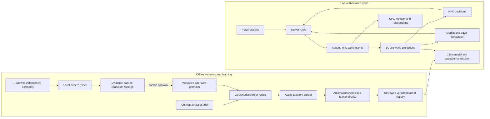

# Project Atlas Vision

## Vision

Project Atlas should grow into a persistent, believable game world with a
traceable model pipeline for all game assets: people, creatures, clothing,
equipment, props, buildings, environments, resources, and other authored
content. It should learn reusable design knowledge from reviewed examples and
trial outcomes, and support NPCs with persistent identities, personalities,
emotional state, memories, goals, and relationships. Towns and cities should
have connected local economies that respond to production, demand, trade, and
events. Players and NPCs should affect the same auditable world state.

Use local deterministic tools for geometry, recipe analysis, and simulation
where practical; keep human review at quality-sensitive stages; and avoid
spending AI tokens on work ordinary code can do. A single image can guide
visible silhouette and appearance, but it does not contain all the depth,
topology, back-side anatomy, or rigging needed for a production model.

The system should also learn reusable design knowledge from collections of
reviewed character recipes. For example, after reviewing many independent troll
examples, it should be able to propose that certain traits or structural
relationships commonly occur together, show the evidence and uncertainty, and
offer those patterns when composing a new troll recipe. Learned patterns are
recommendations until reviewed; they must not silently become universal anatomy
rules.

## Principles

- Keep concept profiles, observed examples, learned findings, approved grammar
  rules, generated meshes, and runtime assets as separate versioned artifacts.
- Preserve source provenance, licenses, checksums, review state, and rule
  evidence at every stage.
- Separate an observed fact from an inference and an approved rule.
- Count independent examples, not repeated edits or renders of the same source.
- Keep generation and recipe analysis deterministic and local by default. No
  remote model call is required for the planned rule miner.
- Treat a low-detail parametric mesh as a blockout. Do not present it as a
  high-quality model or advance it to rigging without a reviewed sculpt or
  suitable high-detail source.
- Let evidence guide new recipes without forcing every member of an archetype
  into the same design. Preserve exceptions, intentional variation, and
  negative evidence.
- A topology pass is structural evidence, not a visual-quality approval.
- Keep simulation state, observations, beliefs, inferences, and decisions
  distinct. NPCs should not know facts they did not observe, learn, or receive.
- Make world changes replayable and explainable. A simulation result or NPC
  proposal is not a deployed world change until its rules permit it.
- Give each subsystem explicit data contracts, time scales, resource budgets,
  and evaluation gates so large populations can run predictably.

## System map

Offline recipe learning changes future authored candidates. Live NPC memory
changes individual behavior. The world event stream connects observable actions
and simulation outcomes to both, while review and policy gates control changes
to shared content or live rules.

## Intended player experience and core gameplay loop

Atlas should feel like inhabiting a persistent place whose people, needs, and
opportunities continue beyond the player's immediate task. The player learns
how the place works by exploring, talking with people, observing events, and
trying things. NPCs have their own knowledge and goals; they are characters to
understand and work with, not menus that reveal the whole simulation. Player
actions can help or harm people, change relationships, move goods, and affect
local conditions, with consequences traceable to what happened.

The intended recurring loop is:

1. **Notice a need, lead, or opportunity.** Hear about a shortage, a person's
   problem, a distant place, a useful resource, or a change in local conditions.
2. **Find out what is happening.** Explore, gather or inspect resources, speak
   with people, compare accounts, and decide what information is reliable. The
   player should not know NPC beliefs or distant events without a way to learn
   them.
3. **Choose an approach and commit resources.** Help directly, gather or make
   something, negotiate or trade, travel, recruit help, or take another
   supported action. Choices should account for time, access, inventory, risk,
   relationships, and the player's knowledge.
4. **Resolve the action through world rules.** The server validates it; accepted
   actions update the shared world and append explainable events. NPCs and
   markets respond according to their own state and information.
5. **See and understand the consequences.** Observe changed supplies,
   opportunities, reactions, and relationships, and learn which actions caused
   them. Outcomes may create new problems or opportunities.
6. **Set the next goal.** New knowledge, trust, skills, resources, access, or
   changed local conditions open different choices and lead into another cycle.

The short-session reward is making a meaningful discovery or completing a
consequential task. Longer-term motivation should come from becoming more
capable and connected, earning access and trust, building or supporting lasting
work, and seeing the region change through accumulated player and NPC actions.
This is a design direction, not a finalized progression or quest system: exact
advancement, ownership, conflict, cooperation, failure, and reward mechanics
still need playtesting. The current client demonstrates movement and a small
interaction prototype; it does not yet implement this full loop or autonomous
NPC/economy responses.
