# Source model intake lifecycle

This workflow connects downloaded reference models to recipe evidence without
confusing references, generated candidates, observations, and runtime assets.
Each transition is explicit; a technical screen or successful import never
approves the next stage automatically.

```mermaid
flowchart LR
  Download[Download and provenance record] --> Rights[Initial rights and source review]
  Rights -->|usable for intended analysis| Intake[Technical dossier and screening]
  Rights -->|conflicting or insufficient| Hold[Quarantine or remove; retain provenance]
  Intake --> Geometry[Human geometry and visual review]
  Geometry -->|accepted as evidence| Observation[Reviewed observation]
  Geometry -->|not useful| Exclude[Exclude from positive evidence; retain decision]
  Observation --> Miner[Future local miner]
  Miner --> Findings[Candidate findings]
  Findings -->|human approval| Recipes[Approved optional recipe guidance]
  Download --> BuildCandidate[Separate geometry authoring/adaptation]
  Recipes --> BuildCandidate
  BuildCandidate --> MeshReview[Geometry review]
  MeshReview -->|later release gates| Runtime[Registered runtime asset]
```

## Stages and handoffs

1. **Acquire and catalogue.** Keep the original download in the workspace's
   source library, currently `/srv/source_models/`. Record the source page,
   creator, exact license evidence, acquisition date, permitted use, archive
   and extracted-file hashes, and source-family lineage. The source library is
   outside this Git repository and is not a runtime directory.
2. **Review intended rights.** Record whether the documented terms allow the
   planned inspection, analysis, training, derivative work, and redistribution
   separately. A conflicting or unresolved license stays quarantined and is
   excluded from observation promotion and reuse. Software can preserve and
   check evidence; it cannot make the legal determination.
3. **Run source intake.** For an eligible humanoid reference, run
   `tools/characters/inspect_character_source.py` on the exact source file.
   It writes a hash-pinned `source_inspection.json`,
   `screening_report.json`, and `observation.draft.json`. Store working outputs
   under ignored `data/source_intake/` or another explicit draft location;
   do not commit working drafts as approved observations.
4. **Review the screen and model.** The technical report is explainable triage.
   It can identify missing geometry, bounds, topology flags, disconnected
   components, or unreliable evaluated geometry. It does not determine visual
   quality, visible anatomy, clothing/occlusion, pose suitability, source
   independence, archetype fit, or rights. A reviewer must inspect the model
   from useful views and record what specific question it can support.
5. **Approve a source observation.** Only after source identity/lineage, rights
   for analysis, geometry, relevant labels and measurements, and reviewer
   rationale are recorded may a draft become a reviewed observation in
   `art/characters/recipe_observations/`. Unknown anatomy remains unknown.
   Variants, exports, and edits from one source lineage do not count as
   independent examples.
6. **Learn candidate patterns.** A future miner may use only compatible,
   independent, reviewed observations whose rights permit that analysis. It
   reports evidence and uncertainty; a person must approve a candidate finding
   before it informs authored recipe guidance.
7. **Build and release separately.** A source observation does not instruct the
   builder and is not a geometry seed. A source-seeded build needs its own
   calibration and geometry/design review. A runtime asset additionally needs
   release rights, technical checks, registration, and exact output hashes.

## Current implementation boundary

The intake command supports humanoid `.blend`, `.glb`, and `.gltf` sources and
emits the technical dossier, first-pass screening report, and unknown-by-default
observation draft. The screening profile is limited to general humanoid anatomy
references. It uses no polygon-count quality score and never approves rights,
visual quality, learning eligibility, geometry-seed use, or runtime release.
There is no approved observation dataset, review queue UI, or recipe miner yet.
Animal and creature sources need separate vocabularies, normalization rules,
and screening profiles before intake.
